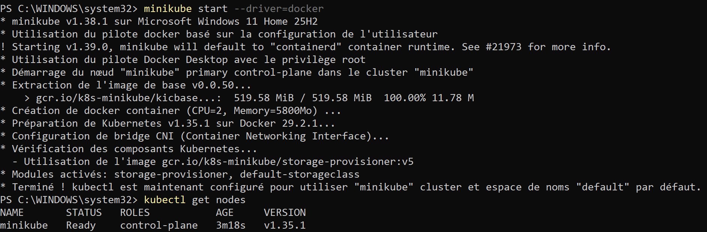
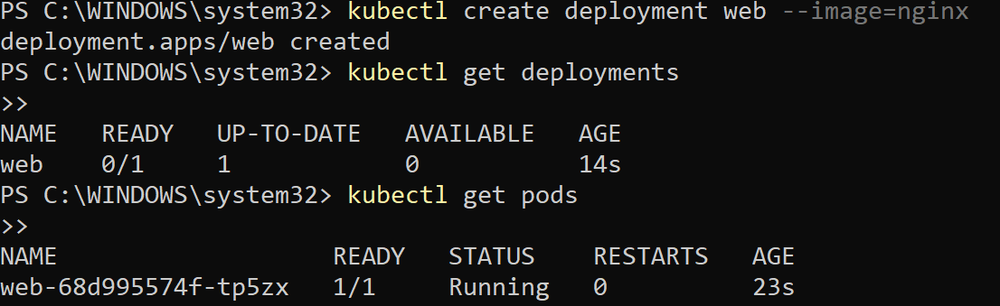
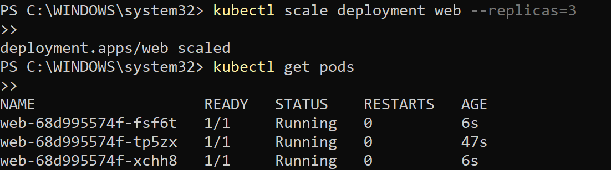
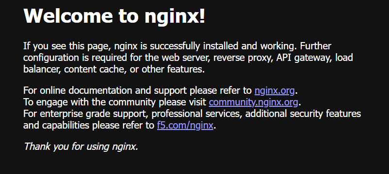
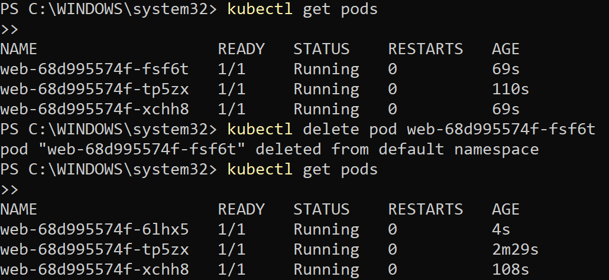

# TP Minikube

## Démarrage du cluster Kubernetes local

## Déploiement d’une application distribuée

##  Mise à l’échelle (scaling)

## Exposition du service

## Simulation d’une panne

## Questions

### 1. Différence entre système centralisé et distribué

Un système centralisé repose sur une seule machine ou un seul point de contrôle pour exécuter le service. Si cette machine tombe en panne, le service devient indisponible.  
Un système distribué, au contraire, répartit le service sur plusieurs machines ou plusieurs instances. Cela améliore la tolérance aux pannes et la disponibilité. [file:40]

### 2. Pourquoi utiliser plusieurs instances d’une application ?

Utiliser plusieurs instances permet de répartir la charge entre plusieurs copies du même service. Cela évite qu’un seul serveur soit surchargé.  
Cela permet aussi de continuer à fournir le service même si une instance tombe en panne, ce qui rend l’application plus robuste. [file:40]

### 3. Que se passe-t-il si un pod tombe en panne ?

Si un pod tombe en panne, Kubernetes le détecte et recrée automatiquement un nouveau pod pour remplacer celui qui est défaillant.  
Le service reste donc disponible, tant que le déploiement et le cluster sont encore opérationnels. [file:40]

### 4. Qu’est-ce que la tolérance aux fautes ?

La tolérance aux fautes est la capacité d’un système à continuer de fonctionner même si un composant tombe en panne.  
Dans ce TP, elle est illustrée par le fait que Kubernetes recrée automatiquement les pods supprimés ou défaillants. [file:40]

### 5. Kubernetes garantit-il la haute disponibilité ?

Non, Kubernetes ne garantit pas à lui seul la haute disponibilité.  
Il fournit des mécanismes qui l’aident à être atteinte, comme la réplication, la surveillance des pods et leur recréation automatique, mais la haute disponibilité dépend aussi de la configuration du cluster, du nombre de nœuds et de l’infrastructure sous-jacente. [file:40]

### 6. Quel est le rôle du load balancing ?

Le load balancing sert à répartir les requêtes entre plusieurs instances du service.  
Cela permet d’équilibrer la charge, d’éviter qu’une seule instance reçoive tout le trafic, et d’améliorer les performances et la disponibilité. [file:40]